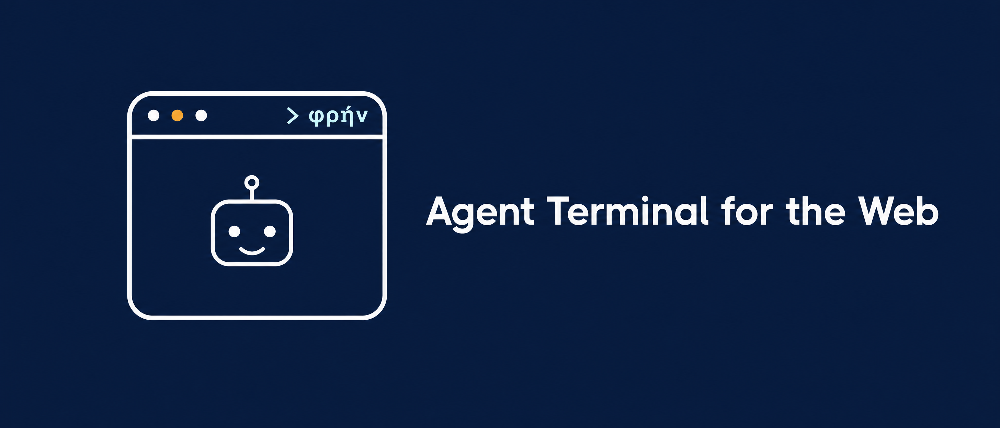
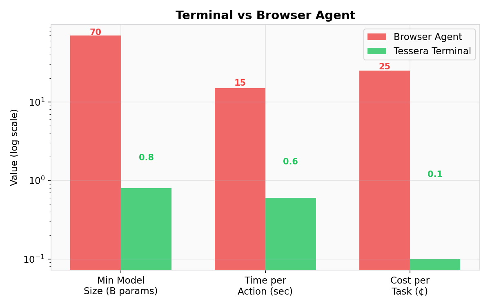
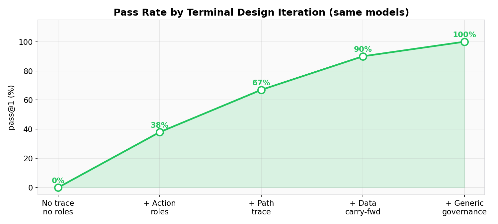
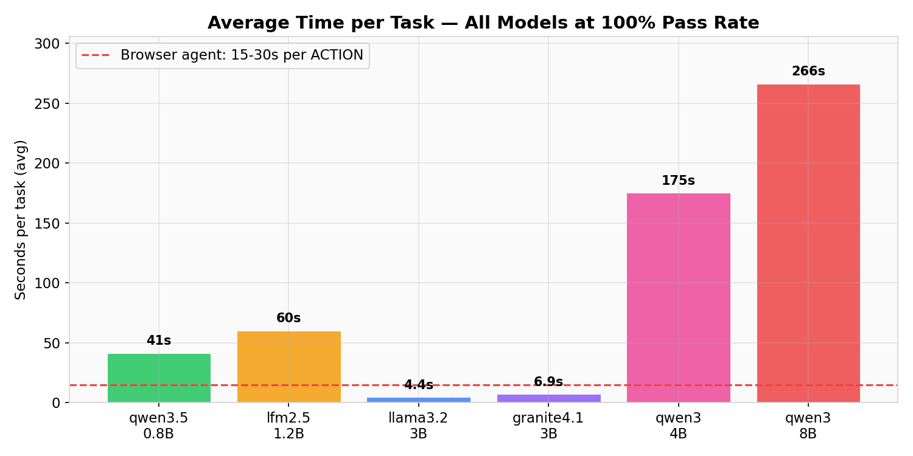
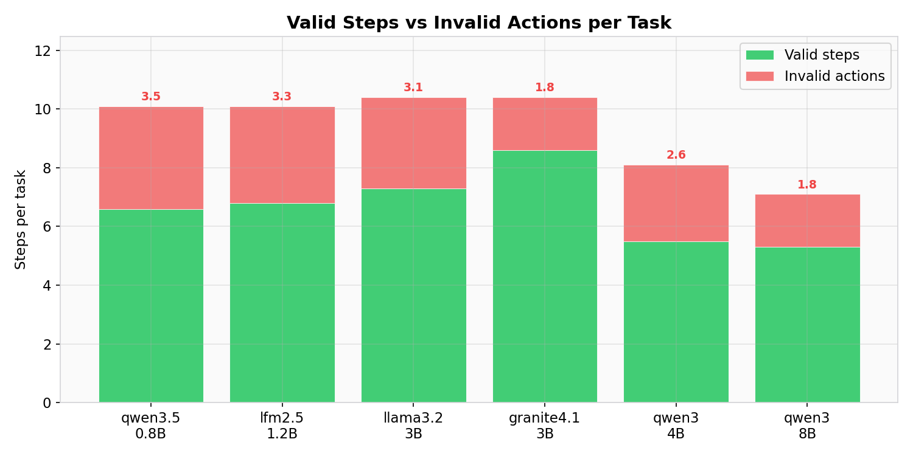

<p align="center">
  
</p>

# Phren — Governed Terminals for AI Agents

Phren compiles any website into a **terminal** — a governed, navigable layer between AI agents and web APIs. Agents navigate terminals via MCP to complete tasks like purchasing, booking, or requesting documents.

## Why not just give agents the API?

```
┌──────────────────────────────────────────────┐
│              MCP (protocol)                  │
│  How the agent talks to tools                │
│                                              │
│  ┌────────────────────────────────────────┐  │
│  │         TERMINAL (governance)          │  │
│  │  What the agent is allowed to do       │  │
│  │  Where it should go next               │  │
│  │  What it already did                   │  │
│  │                                        │  │
│  │  ┌──────────────────────────────────┐  │  │
│  │  │         API (execution)          │  │  │
│  │  │  The actual HTTP calls           │  │  │
│  │  └──────────────────────────────────┘  │  │
│  └────────────────────────────────────────┘  │
└──────────────────────────────────────────────┘

MCP is the WIRE.  The API is the DESTINATION.
The terminal is the RULES + MAP + MEMORY in between.
```

| | Raw API | MCP Tools | Browser Agent | **Phren Terminal** |
|---|---|---|---|---|
| **Governance** | None | None | None | Trust tiers, spend limits, rate limits |
| **Flow guidance** | None | None | None | Roles, hints, path trace |
| **Min model size** | N/A (code) | ~7B | ~70B (vision) | **0.8B** |
| **Speed** | Instant | ~1s/call | 5-30s/action | **0.3-1s/action** |
| **Cost per task** | ¢ | ¢ | $$$ | **¢** |



## Agent eval results

**Terminal design, not model size, determines agent success.** The same models that score 0% without terminal guidance score 100% with it — the improvement comes entirely from the terminal, not the model.



Six models from 0.8B to 8B, 126/126 on linear flows across three domains (e-commerce, hospitality, government). All tasks follow the same shape (login → search → act), tested with 3 trials per model. Branching, error recovery, and adversarial paths remain untested.

| Model | Params | Family | pass@1 | Avg Steps | Avg Invalid | Avg Time |
|-------|--------|--------|--------|-----------|-------------|----------|
| qwen3.5:0.8b | 0.8B | Alibaba | **21/21** | 10.1 | 3.5 | 41s |
| lfm2.5-thinking | 1.2B | Liquid | **21/21** | 10.1 | 3.3 | 60s |
| llama3.2:3b | 3B | Meta | **21/21** | 10.4 | 3.1 | 4.4s |
| granite4.1:3b | 3B | IBM | **21/21** | 10.4 | 1.8 | 6.9s |
| qwen3:4b | 4B | Alibaba | **21/21** | 8.1 | 2.6 | 175s |
| qwen3:8b | 8B | Alibaba | **21/21** | 7.1 | 1.8 | 266s |





**Key finding:** terminal design — not model size — determines agent success. The same models that scored 0% without the terminal's path trace now score 100%.


## What the terminal does for agents

**1. Flow map with roles.** Actions are marked as primary (move forward), secondary (optional), or navigation (go back). Each screen carries a flow hint from the contract.

**2. Path trace.** The agent sees where it's been and what it found:

```
PATH SO FAR:
  ✅ [0] login → got auth token
  ✅ [1] search → found 3: Budget Laptop ($399) [id:prod_004]
  ✅ [2] view_product → name=Budget Laptop

SUGGESTED NEXT: add_to_cart (needs: product_id, quantity)
```

**3. Governance enforcement.** Every contract field binds at runtime: trust tiers, spend limits, rate limits, confirmation gates. The terminal checks all constraints before proxying any action to the real API.

## How it works

```
your-website/api/main.py
        │
        ▼  source parser (10 frameworks)
discovered routes
        │
        ▼  terminal compiler
contract.json (governance + flow map + tools)
        │
        ▼  terminal engine
MCP server (JSON-RPC, stdio + HTTP)
        │
        ▼  agent connects, navigates, completes tasks
```

## Install

```bash
pip install -e ".[dev]"

# Required for running simulations and eval tasks
pip install PyJWT uvicorn fastapi pydantic

pytest evals/ conformance/ -v        # 183 tests
```

> **Note:** Install `PyJWT` (not `jwt`). Both install as `import jwt` but only PyJWT has `encode`/`decode`.

## CLI

```bash
phren info <contract.json>          # Show contract summary: screens, actions, flow hints, limits
phren verify <contract.json>        # Validate a contract (fail-open → error)
phren compile <path> -o out.json    # Compile website source into a contract
phren serve <contract.json>         # Start MCP terminal server (HTTP or stdio)
phren eval <contract.json>          # Run agent eval against a simulation
phren demo                          # One-command demo: start simulation, connect, browse
```

```bash
# Quick start
phren demo
phren info simulations/shopping/contract.json
phren compile simulations/shopping/api -o /tmp/test.json --site-name "My Shop"
```

## Run agent evals

```bash
ollama pull llama3.2:3b
python3 -m evals.agent_eval --task all --model llama3.2:3b --trials 3 -v
```

## Docker

```bash
# Start simulation + Phren terminal server
docker compose up

# Simulation on :8080, Phren MCP on :8000
curl http://localhost:8000/mcp
```

See [docs/quickstart.md](docs/quickstart.md) for the full getting-started guide.

## Trust model

Trust is derived from Ed25519-signed credentials, never self-declared. The terminal verifies the signature, checks expiration, validates the audience, rejects replayed tokens, and caps the trust tier at the operator's registered maximum.

## Supported frameworks

FastAPI, Rails, Go (Chi/Echo), NestJS, Next.js (files/App Router/pages), tRPC, PHP/Laravel. 13 GitHub repos tested: **2,203 routes, 100% precision.**

## Positioning

**Stripe ACP / Google UCP** handle the payment rail. **Phren** handles what the agent is *permitted* to do, proves what it *did*, and guides it through the *flow*. They are complementary.

## Known limitations

Results cover linear flows (login → search → act) on 3 simulations mimicking real website characteristics. Not yet tested on more dense and complex websites. Tested simulations:

| Simulation | Domain | Characteristics |
|---|---|---|
| Shopping | E-commerce | Auth, search, cart state, checkout flow, order confirmation |
| Booking | Hospitality | Date-range queries, room availability, reservation lifecycle |
| Library | Government | Document catalog, department taxonomy, service request submission |

## License

Apache-2.0. Open core never imports the commercial layer.
